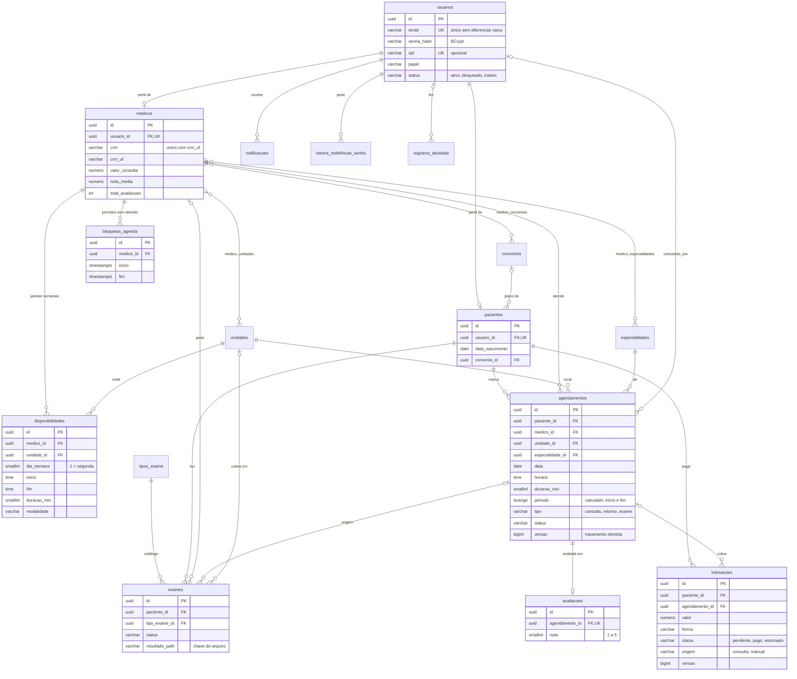

# Banco de dados do SaúdePlus

PostgreSQL 17, com o schema versionado pelo Flyway em
`backend/src/main/resources/db/migration/`. Esta página descreve o modelo: as
entidades, como se relacionam, o que o banco garante sozinho e as evoluções
previstas. Rotas e formatos de resposta estão nos `docs/api*.md`.

## Convenções

| Assunto | Regra |
| --- | --- |
| Chave primária | `uuid` gerado no banco (`gen_random_uuid()`). Ids trafegam como string na API. |
| Instantes | `timestamptz`, gravados em UTC: `criado_em`, `pago_em`, `ultimo_acesso`, início e fim de bloqueio. |
| Data e hora de consulta | `date` + `time` **locais da unidade** (fuso de negócio `America/Sao_Paulo`). Uma consulta às 09:00 é às 09:00 no relógio da clínica, sem conversão. |
| Dinheiro | `numeric(12,2)`. Nunca `float`. |
| Enums | `varchar` com `CHECK`, usando a mesma chave minúscula que trafega no JSON (`em_andamento`, `pix`). Papéis em maiúsculas (`PACIENTE`). |
| Nomes | Tabelas no plural, colunas em `snake_case`, em português, como o código. Índices `ix_*`, únicos `uk_*`. |
| Exclusão | Dados clínicos e financeiros não são apagados: contas são **inativadas**, consultas **canceladas**, cobranças **estornadas**. |
| Schema | Só muda por migração nova (`V6__...sql`). Migração aplicada nunca é editada. O Hibernate apenas valida (`ddl-auto: validate`). |

## Diagrama

Fora do diagrama, sem relacionamentos: `permissoes` (matriz papel × módulo),
`configuracoes` (chave → `jsonb`) e `especialidades`, `convenios` e
`tipos_exame` como catálogos.

## Tabelas por domínio

### Contas e perfis

- **`usuarios`**: a conta de acesso de qualquer pessoa. Papel, situação,
  e-mail e senha ficam aqui; dados que só fazem sentido para um papel ficam
  no perfil. O CPF é gravado sempre no formato `000.000.000-00`, então o índice
  único compara igual com igual.
- **`pacientes`** e **`medicos`**: perfis 1:1 com `usuarios`
  (`usuario_id UNIQUE`). A equipe da clínica (gestor, enfermagem, recepção,
  agente) não tem perfil: só a conta.
- `medicos.nota_media` e `total_avaliacoes` são agregados guardados, para a
  busca ordenar sem somar avaliações. São atualizados por um `UPDATE` atômico
  a cada avaliação, que evita perder notas simultâneas.

### Catálogos e unidades

- **`especialidades`** (com `slug` único, usado na URL da busca),
  **`convenios`** (com `ativo`) e **`tipos_exame`** (com preparo e prazo do
  resultado). Carregados na `V2`, valem em todos os ambientes.
- **`unidades`**: clínicas e laboratórios, com `status` `ativa`,
  `manutencao` ou `inativa`. Só as ativas aparecem na busca e recebem reserva.
- As tabelas de ligação `medico_especialidades`, `medico_convenios` e
  `medico_unidades` usam chave composta, o que impede o mesmo vínculo duas vezes.

### Agenda e agendamentos

- **`disponibilidades`**: janelas semanais de um médico numa unidade
  (segunda, 08:00–12:00, consultas de 30 min, presencial).
- **`bloqueios_agenda`**: períodos sem atendimento (férias, congresso),
  em `timestamptz` porque podem atravessar dias.
- **`agendamentos`**: a consulta marcada. Os horários livres **não são
  gravados**: são calculados (janelas − bloqueios − consultas ativas −
  antecedência mínima). Assim, mudar uma janela não deixa horários órfãos.

Status e quem ocupa horário:

| Status | Ocupa o horário |
| --- | --- |
| `pendente`, `confirmada`, `aguardando`, `em_andamento`, `realizada` | sim |
| `cancelada`, `faltou` | não (o horário volta a ficar livre) |

As transições permitidas estão em
[api-painel-medico.md](api-painel-medico.md#status-de-consulta) e são
validadas no código (`StatusAgendamento`).

### Exames

- **`exames`**: do pedido ao resultado (`solicitado` → `agendado` →
  `em_analise` → `liberado`, ou `cancelado`). Pode nascer de uma consulta
  (`agendamento_origem_id`) e ter a coleta marcada numa unidade.
- O arquivo do resultado **não fica no banco**: `resultado_path` guarda só a
  chave (`<uuid>.pdf`) do arquivo em disco (`saudeplus.arquivos.dir`).

### Avaliações, notificações e financeiro

- **`avaliacoes`**: no máximo uma por consulta (`agendamento_id UNIQUE`),
  nota de 1 a 5.
- **`notificacoes`**: a caixa de avisos de cada usuário.
- **`transacoes`**: cobranças. A automática (`origem = 'consulta'`) nasce
  `pendente` quando a consulta é confirmada; a administração também lança
  cobranças avulsas (`origem = 'manual'`). `data_hora` é o lançamento, `pago_em` e `estornado_em` são os
  eventos. A forma de pagamento é opcional até o pagamento.

### Segurança, configuração e auditoria

- **`tokens_redefinicao_senha`**: guarda só o **SHA-256** do token (quem
  copiar a tabela não consegue montar um link válido), com validade e uso único.
- **`permissoes`**: uma linha libera um papel num módulo da administração.
- **`configuracoes`**: grupos de ajustes em `jsonb` (`gerais`,
  `agendamento`, `notificacoes`…), validados pela aplicação antes de gravar.
- **`registros_atividade`**: auditoria das ações administrativas, com quem,
  o quê, sobre qual registro e de qual IP. Continua existindo se a conta for
  apagada (`ON DELETE SET NULL`).

## O que o banco garante sozinho

Regras que valem mesmo com duas requisições ao mesmo tempo, ou com um bug na
aplicação:

| Regra | Como |
| --- | --- |
| E-mail único, sem diferenciar maiúsculas | `uk_usuarios_email` sobre `lower(email)` |
| CPF único quando informado | `uk_usuarios_cpf ... WHERE cpf IS NOT NULL` |
| Um CRM por UF | `UNIQUE (crm, crm_uf)` |
| **Um horário do médico só tem uma reserva ativa** | `uk_agendamentos_horario_ativo (medico_id, data, horario) WHERE status NOT IN ('cancelada', 'faltou')`: a segunda reserva simultânea falha e vira `409` |
| **Consultas ativas não se sobrepõem**, nem do mesmo médico nem do mesmo paciente, mesmo com inícios diferentes (08:00 de 30 min e 08:20) | restrições de exclusão `ex_agendamentos_medico_sem_sobreposicao` e `ex_agendamentos_paciente_sem_sobreposicao` sobre a coluna calculada `periodo` (`V6`). Viram `409` com a mensagem certa ("horário acabou de ser reservado" ou "você já tem uma consulta nesse horário"). Consultas encostadas (uma termina às 08:30, outra começa às 08:30) são permitidas |
| Duas alterações simultâneas da mesma consulta ou cobrança não se sobrescrevem | coluna `versao` (`@Version`, `V5`): a segunda falha e vira `409` |
| Uma cobrança automática ativa por consulta | `uk_transacoes_cobranca_da_consulta (agendamento_id) WHERE origem = 'consulta' AND status <> 'estornado'` (`V6`). Lançamentos manuais (`origem = 'manual'`: taxa, exame particular) continuam livres, e depois de um estorno a consulta pode ser cobrada de novo |
| Uma avaliação por consulta | `avaliacoes.agendamento_id UNIQUE` |
| Valores válidos | `CHECK` em todo enum, em `nota` 1–5, em `valor >= 0`, em `dia_semana` 1–7, em `duracao_min` 5–240 e em `inicio < fim` |
| Nada órfão | chaves estrangeiras em todas as referências |

Regras que ficam na aplicação, porque dependem de contexto: transições de
status, antecedência para cancelar, horário dentro da disponibilidade e quem
pode ver o quê. A aplicação também confere sobreposições antes de gravar, para
responder com a mensagem certa; o banco é a garantia final.

## Índices

Além das chaves primárias e únicas:

| Índice | Atende |
| --- | --- |
| `ix_agendamentos_medico_data` | agenda do dia do médico, cálculo de horários livres |
| `ix_agendamentos_paciente_data` | consultas e histórico do paciente |
| `ix_agendamentos_unidade_data`, `ix_agendamentos_especialidade_data` | filtros por unidade e especialidade na lista de agendamentos e nos relatórios da administração |
| `ex_agendamentos_*_sem_sobreposicao` (GiST) | as restrições de sobreposição; também servem a buscas por intervalo |
| `ix_exames_status_prazo` | fila de exames da clínica, por status e prazo |
| `ix_disponibilidades_medico` | janelas do médico por dia da semana |
| `ix_bloqueios_medico` | bloqueios no período consultado |
| `ix_exames_paciente`, `ix_exames_medico_status` | exames do paciente; pedidos pendentes do médico |
| `ix_avaliacoes_medico` | avaliações do perfil público |
| `ix_notificacoes_usuario (usuario_id, lida, criada_em DESC)` | caixa de avisos e contagem de não lidas |
| `ix_transacoes_data`, `ix_transacoes_pago_em`, `ix_transacoes_agendamento`, `ix_transacoes_paciente` | resumo financeiro por período, cobrança da consulta, pagamentos do paciente |
| `ix_registros_criado`, `ix_registros_usuario` | consulta da auditoria |

## Exclusão e ciclo de vida

- `ON DELETE CASCADE` só onde o dado não tem valor sozinho: vínculos do
  médico (especialidades, convênios, unidades, janelas e bloqueios),
  notificações e tokens de um usuário.
- Consultas, exames, avaliações e cobranças **impedem** apagar o paciente ou
  o médico (sem `CASCADE`): prontuário e financeiro não somem por engano.
  Para tirar alguém do sistema, a conta vira `inativo`.

## Migrações

| Versão | Conteúdo |
| --- | --- |
| `V1__schema.sql` | schema completo |
| `V2__seed_referencia.sql` | especialidades, convênios, tipos de exame, permissões e configurações iniciais |
| `V3__permissoes_padrao_seguras.sql` | matriz de permissões conservadora |
| `V4__transacoes_pagamento.sql` | forma de pagamento opcional, `pago_em`, `estornado_em` |
| `V5__controle_de_concorrencia.sql` | coluna `versao` em `agendamentos` e `transacoes` |
| `V6__integridade_da_agenda_e_lgpd.sql` | extensão `btree_gist`, coluna `periodo` e as restrições de sobreposição; índices da administração; `transacoes.origem` e a cobrança única por consulta; comentários LGPD nas colunas de dados de saúde |
| `db/demo/R__dados_demonstracao.sql` | só em `dev` e `test`: unidades, médicos, pacientes e agendas de exemplo, com ids fixos e `ON CONFLICT DO NOTHING` |

### Ao aplicar a V6 num banco que já tem dados

- As restrições de sobreposição **não são criadas** se já houver consultas
  ativas sobrepostas: a migração falha e o banco fica como estava. O comentário
  no topo da `V6` traz a consulta que lista os pares em conflito, para resolver
  (cancelar ou remarcar uma delas) e rodar de novo.
- `btree_gist` vem com o PostgreSQL. Em banco gerenciado (RDS, Cloud SQL,
  Azure), confira se a extensão está na lista permitida.
- Cobranças antigas não diziam a origem. A migração marca como `consulta` a
  mais antiga ainda ativa de cada consulta, e as demais como `manual`.

## LGPD e retenção

Os dados de saúde (`agendamentos.motivo`, `resumo`, `desfecho`, `exames` e os
arquivos de resultado) são **dado pessoal sensível** (LGPD, art. 5º, II, e
art. 11). Um comentário no schema marca cada um, para quem consulta, exporta
ou faz backup.

| Medida | Onde |
| --- | --- |
| Leitura de dado de saúde por terceiro fica registrada: o médico abrir a ficha de um paciente (`paciente.ficha.ver`) ou o resultado de um exame (`exame.resultado.ver`) | `registros_atividade`, consultável em `/api/admin/auditoria` |
| Prazos de guarda de dados operacionais, apagados por rotina diária (`saudeplus.retencao.cron`, padrão 03:30) | `retencao/RetencaoDeDados` |
| Notificações **lidas**: 180 dias (as não lidas ficam) | `saudeplus.retencao.notificacoes-lidas` |
| Links de redefinição de senha: 30 dias depois de vencidos | `saudeplus.retencao.tokens-de-senha` |
| Auditoria: 5 anos; a aplicação não sobe com menos de 6 meses (Marco Civil da Internet, art. 15) | `saudeplus.retencao.auditoria` |
| **Prontuário, exames e cobranças não são apagados por rotina**: a Resolução CFM 1.821/2007 manda guardar o prontuário por 20 anos, e registros fiscais têm prazo próprio | — |

Fica por conta da infraestrutura, fora do código:

- criptografia em repouso do disco do banco, dos backups e da pasta
  `saudeplus.arquivos.dir` (recurso do provedor);
- acesso ao banco de produção só por pessoas autorizadas, com o próprio acesso
  registrado;
- política de backup (frequência, onde fica, por quanto tempo) documentada.

Ainda não existem, e ficam como próximos passos: exportar os dados de um
paciente a pedido dele (direito de acesso e portabilidade, art. 18) e
particionar `registros_atividade` por mês quando o volume crescer.
